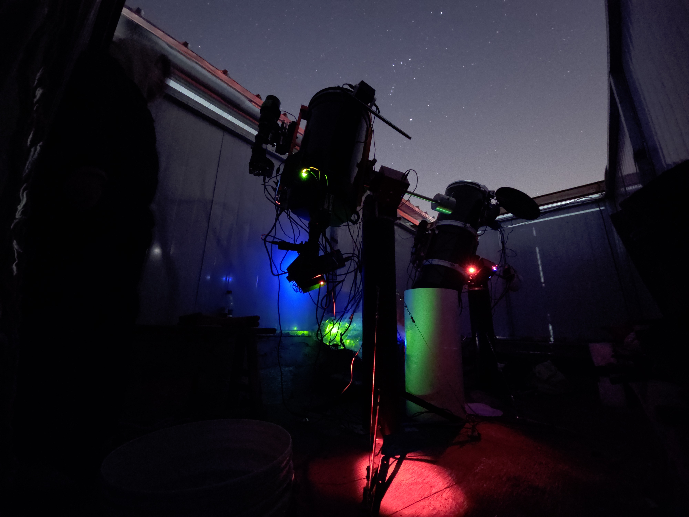
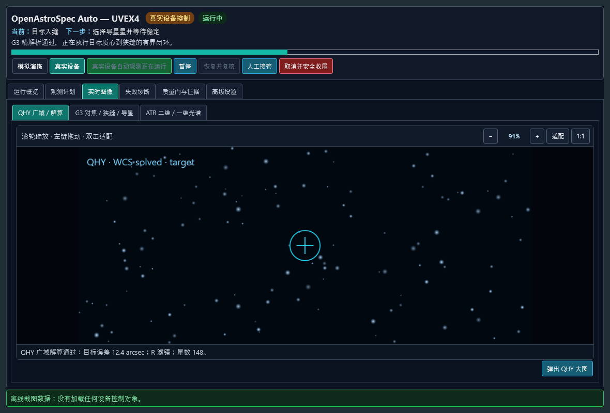

# OpenAstroSpec Auto — UVEX4

[简体中文](README.zh-CN.md) | **English**

[](https://github.com/sedirk/openastrospec-auto-uvex4/actions/workflows/ci.yml)
[](LICENSE)


OpenAstroSpec is an open-source astronomical-spectroscopy project family. This
repository contains **OpenAstroSpec Auto — UVEX4**, the automated observing and
observatory-orchestration product line with UVEX4 as its first fully supported
spectrograph implementation, plus its offline Spectral Studio companion.

> [!IMPORTANT]
> This repository is an **engineering preview under hardware commissioning**, not a
> generic unattended-observatory safety certification. It starts in simulation and
> fail-closed modes. Real motion, guiding, acquisition, and unattended science remain
> unavailable until the site-specific evidence and safety gates described in the
> commissioning documentation have passed.

**Start here:** [Observatory product](products/observatory/README.md) ·
[Spectral Studio](products/spectral-studio/README.md) ·
[build and simulator](#build-and-run-the-simulator) ·
[commissioning](docs/commissioning.md) ·
[latest real-sky closeout](docs/commissioning-night-2026-08-25.md) ·
[operator SOP](docs/observatory-automation-sop.md) ·
[known issues](docs/known-issues.md) ·
[contributing](CONTRIBUTING.md)

The repository contains two user-facing GPL-3.0-only software products:

| Product | Purpose | Start here |
|---|---|---|
| **OpenAstroSpec Auto — UVEX4 (observing control)** | N.I.N.A. workflow, equipment ownership/orchestration, commissioning, live QHY/G3/ATR diagnostics, and immutable run evidence | [`products/observatory/README.md`](products/observatory/README.md) |
| **OpenAstroSpec Spectral Studio — UVEX4 (spectral processing)** | Offline FITS inspection, reduction, 2D/1D visualization, wavelength/response calibration, and delivery | [`products/spectral-studio/README.md`](products/spectral-studio/README.md) |



_The observatory environment used to develop and commission OpenAstroSpec Auto —
UVEX4. This photograph documents the physical context; it is not evidence that the
site has passed the unattended-operation safety gates._



_The screenshot above is generated by the offline UI harness. It contains no live
equipment state and does not connect to observatory hardware._

The two products share source history and scientific data contracts, but they do not
share hardware authority. Spectral Studio is strictly offline. Observatory replaces the
daily-control portion of DRIVER.UVEX4 with single-owner Windows services, a standalone
WPF manager, and a N.I.N.A. 3.2 plugin.

The project is independent community software and is not an official release of
the UVEX4 project or N.I.N.A. The ground-based UVEX4 spectrograph supported here is
unrelated to NASA's UVEX space mission. The accepted public name and the deliberately
retained `UVEX-ADV` / `UvexAdv.*` compatibility identifiers are defined in the
[`brand and name-migration policy`](docs/project-branding-and-name-migration.md).

Original source code is licensed under
[`GPL-3.0-only`](LICENSE). Independent applications, drivers, vendor SDKs, scientific
packages, and observation data retain their own terms; see
[`THIRD_PARTY_NOTICES.md`](THIRD_PARTY_NOTICES.md). Before making the repository public,
complete the [`open-source release checklist`](docs/open-source-release-checklist.md).
Current operator and release limitations are tracked in
[`known issues`](docs/known-issues.md).

## Authoritative acquisition design

The frozen design target for the next acquisition-automation phase is
[`docs/design/observatory-automation-baseline.md`](docs/design/observatory-automation-baseline.md).
The per-device ownership decision is recorded in
[`ADR-0001`](docs/adr/0001-single-owner-device-orchestration.md). The optional,
versioned hand-off between the two optical fields is specified by
[`ADR-0004`](docs/adr/0004-optional-versioned-wide-to-slit-field-transfer.md).
These are normative:

- N.I.N.A. owns ATR585M for spectra;
- PHD2 owns G3M2210M for the slit field and guiding;
- the isolated `UvexAdv.Qhy.Service` owns QHYminiCam8M for GS350 coarse acquisition and simultaneous photometry;
- `UvexAdv.Service` alone owns UVEX4 COM5.

The repository now includes the QHY service, the PHD2 event-server client, the target-acquisition state machine, and the N.I.N.A. real/simulator runners. Healthy stages advance automatically without confirmation dialogs. Failed or indeterminate gates enter `PausedNeedsAttention`; the operator can always pause, resume, cancel, or request manual takeover. Simulator-first commissioning remains mandatory. The authoritative design hashes are checked by the build and versioned Git hook so accidental architectural edits fail visibly.

The current GS350/QHY-to-C11/G3 optical-axis difference is never a compiled
constant. A future optional pre-positioning stage consumes an explicitly selected,
versioned record with provenance, hardware/installation fingerprint, pier-side and
environment applicability, expiry, uncertainty, and motion limits. Its default
policy is `AutoIfValidElseSkip`, and the operator can visibly select `Skip`. Missing
or stale evidence falls back to QHY coarse centering followed by a direct G3 solve
and bounded local G3 search; it does not silently reuse a remembered offset.

The ordinary stellar core loop has completed two real-sky, single-start runs
without manual or model correction after launch. This is evidence for target
placement, guiding and paired ATR/QHY acquisition—not a claim that the roof and
weather system are unattended. The evidence boundary and remaining sparse-field
work are documented in the
[`2026-08-25/26 M76 faint-target closeout`](docs/commissioning-night-2026-08-25.md)
and the
[`faint-target and sparse-field design`](docs/design/faint-target-and-sparse-field-acquisition.md).

Repository contribution, data-separation and frozen-design rules are in
[`CONTRIBUTING.md`](CONTRIBUTING.md) and [`AGENTS.md`](AGENTS.md).
The current/projected component map is in
[`docs/repository-layout.md`](docs/repository-layout.md).

The separately packaged Python post-processing product (FITS inspection, ASPIRED extraction,
Spectrum1D/FITS/CSV/PNG products) is documented in
[`reduction/README.md`](reduction/README.md). It does not access COM5 or camera drivers.
Its desktop GUI is available through the `OpenAstroSpec 光谱处理 - UVEX4`
(`OpenAstroSpec Spectral Processing - UVEX4`) shortcut or
the developer fallback `Launch-UVEX-Spectrum-GUI.cmd`; it now supports quality-gated
wavelength calibration from the local ISIS stellar-template database. The installed
shortcut targets a native `.NET 8` launcher, matching the manager shortcut instead of
exposing a command file or Python executable.

Reduced spectra are organized under `reduction/output/Target/YYYY-MM-DD/`. Double-click
`reduction/output/00-打开结果索引.html` (the “open result index” page) for the visual catalogue; historical runs and
quality studies are retained separately under `reduction/output/_internal/`.

## Safety status

- The checked-in configuration uses the UVEX simulator. It does not open COM5.
- Production serial transport is fixed to COM5 at 115200 8N1 and verifies `VID_1A86&PID_7523` through the Windows device registry before opening it.
- Motor commands additionally require a renewable exclusive lease and configured software travel limits.
- The plugin starts with `Commissioned=false`; spectral analysis works, but closed-loop motor movement is blocked until ROI, spectral lines, backlash, and limits are measured.
- EEPROM/network writes, firmware updates, blind serial-port scans, and direct ToupTek SDK access are intentionally absent.

## Components

- `UvexAdv.Service`: loopback-only API (`http://127.0.0.1:47844`), SignalR telemetry, Windows-service hosting, simulator/serial transports, operation audit database and rolling JSON logs.
- `UvexAdv.Admin`: Chinese standalone manager using only the service API.
- `UvexAdv.Nina.Plugin`: N.I.N.A. panel and advanced-sequencer items. ATR585M exposures are requested through `IImagingMediator`; PHD2/G3M2210M are never opened by this project.
- `UvexAdv.Qhy.Service` / `UvexAdv.Qhy.Core`: loopback-only single-owner QHYminiCam8M acquisition and photometry service, immutable FITS/preview products, frame metrics, idempotent jobs, control leases, and simulator/replay adapters.
- `UvexAdv.Phd2`: strict PHD2 event-server client for profile/equipment/calibration gates, full-frame evidence capture, guide-star selection, guiding/settle, and Windows profile-binding evidence. It never opens G3M2210M itself.
- `UvexAdv.Observatory`: device-neutral observation plan, horizon/motion gates, automatic stage coordinator, cooperative pause/resume/cancel/takeover, slit-field analysis, commissioning transforms, and observation manifests.
- `UvexAdv.Reduction.Launcher`: native desktop entry point for the isolated Python reduction workbench.
- `UvexAdv.Spectroscopy`: managed spectrum extraction, line centroid/FWHM, focus-curve fitting and wavelength-loop engines.
- `UvexAdv.Protocol` / `UvexAdv.Core`: documented UVEX protocol, incremental parser, leases, state machine, motion limits and stop behavior.

## Build and run the simulator

```powershell
powershell -ExecutionPolicy Bypass -File .\scripts\build.ps1
.\artifacts\service\UvexAdv.Service.exe
.\artifacts\qhy-service\UvexAdv.Qhy.Service.exe
.\artifacts\admin\UvexAdv.Admin.exe
```

The build publishes, but does not install, the N.I.N.A. plugin. Close N.I.N.A., install the plugin, and then restart N.I.N.A.:

```powershell
powershell -ExecutionPolicy Bypass -File .\scripts\install-nina-plugin.ps1
```

For compatibility it is still installed under
`%LOCALAPPDATA%\NINA\Plugins\3.0.0\UVEX-ADV Spectroscopy`, but it appears as
`OpenAstroSpec Auto — UVEX4`, the `OpenAstroSpec 自动观测` and
`OpenAstroSpec 校准库` dock panels, and the
`OpenAstroSpec Auto` advanced-sequencer category. The folder name and plugin GUID
remain unchanged so existing N.I.N.A. profiles continue to load the same plugin.
ATR585M identity binding and one-frame extraction checks are integrated under
`OpenAstroSpec 自动观测 → 实时图像 → ATR 二维/一维光谱`; there is no separate
placeholder spectrum dock.

The QHY service is installed separately and defaults to the synthetic simulator:

```powershell
# Run from an elevated PowerShell after scripts\build.ps1.
powershell -ExecutionPolicy Bypass -File .\scripts\install-qhy-service.ps1
```

`-EnableHardware -HardwareConfigurationPath <machine-local-qhy-json>` pins and copies
the locally installed x64 QHY SDK, verifies its versioned SHA-256, requires an exact
commissioned QHY stable identity from that explicit machine-local file, and still
exposes only `http://127.0.0.1:47845`. The tracked `config/qhy.production.json` is an
intentionally non-runnable example. Do not enable hardware until the simulator,
locked Night Setup, PHD2 profile evidence, slit geometry, plate solving, and bounded
pixel-to-mount transform all pass commissioning.

Create an ignored `config/qhy.local.json` from that example, replace every placeholder
with the commissioned value, then make the machine-local choice explicit:

```powershell
powershell -ExecutionPolicy Bypass -File .\scripts\install-qhy-service.ps1 `
  -EnableHardware -HardwareConfigurationPath .\config\qhy.local.json
```

## Automated target observation

The operator-facing Chinese SOP is
[`docs/observatory-automation-sop.md`](docs/observatory-automation-sop.md). It covers
Night Setup, calibration bracketing, the 40-degree wall horizon, live previews,
pause/resume/cancel/takeover, evidence review, failure recovery, and the current
supervised-commissioning restriction while Dome/Roof and Safety Monitor inputs are
unavailable.

The durable problem list, night-theme rules, screenshot matrix, and operator UI
acceptance record are in
[`docs/observation-operator-ui-acceptance.md`](docs/observation-operator-ui-acceptance.md).
Its isolated WPF harness renders the real production data template with deterministic
mock states; it never constructs the production dockable or contacts equipment.

The `OpenAstroSpec 自动观测` (`OpenAstroSpec Automated Observation`) dock now separates
**UVEX manual preparation** from **automated observation**. It remembers the selected
`UVEX4 / COM5` device but opening the service or dock does not connect hardware. The
operator explicitly presses Connect to open COM5 and read live positions; Disconnect
closes the port and remains disconnected without a background retry. Once connected,
manual preparation uses the sole `UvexAdv.Service` owner to select any of the four
mechanical slit positions, toggle slit illumination, jog M2 within service-enforced
bounds, or explicitly release COM5 to the vendor application. It does not require Night Setup,
PHD2, QHY, WCS, or the full automated-observation commissioning package. Automated
observation still offers **simulated automation** and **real automation** with one
mode-aware start button. Its structured preparation form reads connected N.I.N.A.
identities automatically, imports immutable bindings and Night Setup evidence in one
selection, uses selectors for operator choices, and marks the incomplete field card in
red instead of dumping internal validation strings into the main footer. The dock also
shows QHY/GS350, PHD2/G3 slit-field, and ATR spectrum previews, the current and next
stage, quality gates, timeline, evidence files, and remaining progress. A normal run is:

The target draft can be copied once from N.I.N.A.'s Framing Assistant or from the
currently selected object in N.I.N.A.'s configured planetarium (including
Stellarium). The plugin normalizes the snapshot to J2000 degrees and records its
source and time. Import never connects equipment or starts a run, does not alter
Night Setup, commissioning, duration, or safety settings, and does not rewrite
Advanced Sequence containers that were already created. Multi-panel framing is
rejected until a panel-selection workflow exists.

Advanced Sequence target-observation containers now publish that target through
N.I.N.A.'s native `IDeepSkyObjectContainer`/`InputTarget` contract. ATR files are
still saved only by N.I.N.A. The recommended active-profile file pattern is
`$$DATEMINUS12$$\$$TARGETNAME$$\$$IMAGETYPE$$\$$DATETIME$$_$$TARGETNAME$$_$$EXPOSURETIME$$s_G$$GAIN$$_O$$OFFSET$$_$$FRAMENR$$`.
The Advanced Settings page displays the current and recommended values and offers
explicit apply/undo commands; the plugin never rewrites a profile at startup. Each
saved ATR FITS is then reopened read-only and checked for stable `OBJECT`, run ID,
stage, capture ID, Night Setup, image type, and optional catalogue identity. A
mismatch retains the immutable raw file but prevents it from being claimed as
accepted science. See [ADR-0007](docs/adr/0007-nina-native-target-and-image-provenance.md).

1. Validate the immutable Night Setup, schema-3 commissioning preset, exact device
   identities, environment, target horizon for the remaining worst-case block, UVEX
   positions, and the versioned PHD2 calibration-quality policy. The currently active
   PHD2 calibration is graded rather than reduced to one orthogonality cutoff;
   degraded operation and direct-target guiding are explicitly supervised-only.
2. Slew to catalog coordinates, acquire/solve QHY wide-field FITS, and apply bounded
   signed corrections with a fresh solve after each move. Optionally apply a
   separately commissioned wide-to-slit-field pre-positioning record; invalid or
   explicitly skipped records cause no intermediate move.
3. Acquire a fresh G3 slit field through PHD2 using a commissioned long-exposure
   ladder. A successful WCS that leaves the target outside the detector drives
   bounded N.I.N.A. centering and a fresh solve; a structured sparse field with at
   least one coherent source may enter the configured small-step search. A zero-source
   or cloud/transparent-field ambiguity never authorizes motion. Optional calibrated
   ghost matching may estimate a bright target's centroid, but cannot establish its
   identity or authorize movement by itself. After target and slit are measured, the
   preferred fine-motion authority is the current qualified/explicitly supervised
   PHD2 calibration plus staged exact-lock shifts, with a separately commissioned
   G3-pixel-to-mount transform as the fallback. The ordinary path first selects a
   guide star from a fresh seconds-exposure frame; only the explicit degraded path
   guides directly on an ultra-bright target at its separately commissioned short
   exposure. Every stage settles and is remeasured in a fresh immutable G3 frame.
4. Start leased QHY photometry, probe the ATR spectral ROI, select a safe discrete
   exposure tier, save quality-gated science frames through N.I.N.A., then finalize
   only after QHY and PHD2 terminal states are verified.

There are no routine “continue?” gates. `Pause` takes effect before the next bounded
motion or exposure; `Resume` revalidates stale gates; `Cancel` performs verified
cleanup; `Take over` releases coordinated ownership while leaving the run paused.

## ATR585M dark/bias library

Open the `OpenAstroSpec 校准库` dock panel in N.I.N.A. It captures through N.I.N.A.'s
`IImagingMediator`, saves raw 16-bit FITS files, writes a resumable JSON session
manifest with SHA-256 hashes, and can build a streaming one-high/one-low trimmed-mean
master when a group has at least five frames. It never loads the ToupTek SDK itself.

The directory key includes camera identity, gain, offset, binning, readout mode,
temperature, frame type, and exposure time. The commissioned ATR585M defaults are
gain 100, offset 256, 1x1, High Conversion Gain, and -10 C. These keys must match the
science frames; the plugin stops if the connected camera or readout mode changes.
Master dark files intentionally retain the camera bias pedestal and are marked with
`DARKBIAS = T`; downstream reduction must not subtract a master bias as well unless
it first converts the dark master to dark current.

The ATR585M reports no mechanical shutter. Consequently the panel requires a fresh,
non-persistent confirmation that the cap and roof are closed for every run. For a
confirmed unattended observatory run, queue the same guarded request before starting
or reconnecting N.I.N.A.:

```powershell
powershell -ExecutionPolicy Bypass -File .\scripts\request-calibration-library.ps1 `
  -ConfirmDarkness -CameraId '<commissioned-atr585m-device-id>' `
  -BiasFrameCount 32 -DarkFrameCountEach 5
```

The request contains the exact ATR585M DeviceId and expires after four hours. The
plugin ignores it until that exact camera is connected and idle; it never selects a
camera by list position. Raw files default to
`%USERPROFILE%\Documents\UVEX-ADV Calibration Library`.
Replace `<commissioned-atr585m-device-id>` in the example with the exact value from
the active machine-local N.I.N.A. profile; the script has no hardware identity default.

The ATR585M offset decision and the retired initial seed run are recorded in
[`docs/calibration-library-seed-20260816.md`](docs/calibration-library-seed-20260816.md).
The gain-100/offset-16 calibration tree was deliberately deleted; do not reuse or
reconstruct it. New bias, dark, flat, and science frames for this camera should use
offset 256 so their compatibility keys agree.

The ATR585M camera was commissioned on 2026-08-16 with the official FPGA 5.0
firmware and ToupCam SDK 60. Three independent repeated-ROI tests (direct SDK,
unmodified N.I.N.A. 3.2 equipment driver, and the older SDK bundled with ToupSky)
all returned zero inter-frame displacement after the upgrade. Checksums, raw FITS,
rollback paths, and the reason the same historical fault appeared in both ToupSky
and N.I.N.A. are recorded in
[`docs/atr585m-sdk-firmware-commissioning-20260816.md`](docs/atr585m-sdk-firmware-commissioning-20260816.md).

The local SDK is intentionally ignored by Git. If `.dotnet` is absent, install .NET 8 SDK 8.0.419 or update `global.json` and validate N.I.N.A. compatibility.

`scripts/install-service.ps1` installs in simulator mode unless the explicit `-EnableHardware` switch is supplied. Existing `%ProgramData%\UVEX-ADV\config.json` is always preserved.

For this commissioned COM5 computer, close N.I.N.A., double-click
`Install-UVEX-ADV-Hardware.cmd` once, and accept the administrator prompt. The
legacy script filename is retained for compatibility. It builds/tests the project,
installs both automatic Windows services, installs the N.I.N.A. plugin, and creates
an `OpenAstroSpec Auto - UVEX4 Manager` desktop shortcut. If N.I.N.A. is still
open, the installer stops before changing either service so the plugin and services
cannot be left at different versions. The plugin installer also rejects stale
publish output that lacks the observation, PHD2, or QHY modules. After setup, do not
launch a service executable manually; open only the desktop shortcut.

## Real-hardware commissioning

Do not set `Simulator=false` until the steps in
[docs/commissioning.md](docs/commissioning.md) are complete. DRIVER.UVEX4 and the
legacy-named `UVEX-ADV` Windows service must never own COM5 at the same time.

Protocol implementation is based only on the public
[UVEX4 serial protocol](https://spectro-uvex.tech/wp-content/uploads/2022/02/spec-driver-spectro.pdf).
The duplicated `FSTE` entry in that document is treated as ambiguous; this project
uses the unambiguous relative focus commands `FGIN`, `FGOU`, `FHOM`, and `FSTP`.
